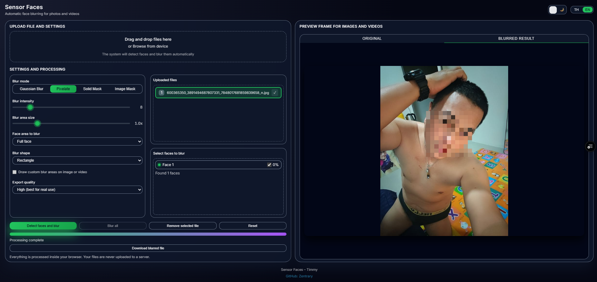

# Sensor Faces



## English

### Overview
Sensor Faces is a fully client‑side web app for blurring faces in images and videos. It runs entirely in your browser, never uploading files to any server. The app supports English/Thai UI, multiple blur modes, and exports PNG for images and MP4 for videos when possible.

### Features
- On‑device face detection and blurring (no uploads)
- Image formats: JPG, PNG, WEBP
- Video formats: MP4, MOV, WEBM (exports MP4 if supported by your browser)
- Multi‑face detection with adaptive confidence tuning
- Blur regions: full face, eyes only, mouth only, eyes+mouth
- Blur shapes: rectangle or ellipse for natural‑looking masks
- Manual custom areas (draw to blur any region)
- EN/TH language toggle, light/dark theme

### Quick Start
1) Clone or download this repository.  
2) Open `index.html` directly in your browser, or run `start-localhost.bat` to preview on `http://localhost:8000/` (requires Python installed).  
3) Drag an image/video into the drop zone and press “Detect faces and blur”.  
4) Download the processed result as PNG/MP4.

### Upload to GitHub (GitHub Desktop)
1) Open GitHub Desktop and choose “File → New repository…”.  
2) Set the “Local path” to this folder (`Sensor Faces`) and click “Create repository”.  
3) Click “Commit to main” then “Publish repository” to push it to GitHub.  
4) After publishing, click “Open on GitHub” to view your repository online.

### Upload to GitHub (Git CLI)
```bash
git init
git add .
git commit -m "Initial commit: Sensor Faces"
git branch -M main
git remote add origin https://github.com/<your-username>/<your-repo>.git
git push -u origin main
```

### Deploy via GitHub Pages
1) On GitHub, open “Settings → Pages”.  
2) Under “Build and deployment”, select “Deploy from a branch”.  
3) Choose branch “main” and folder “/ (root)”, then Save.  
4) Wait a minute and your site will be available at `https://<your-username>.github.io/<your-repo>/`.

### Folder Structure
- `index.html` – main page
- `css/` – styles
- `js/` – application logic
- `images/2.png` – screenshot used in this README
- `start-localhost.bat` – quick local preview server

### Privacy
All processing happens in your browser. Files are never sent to any server.

---

## ภาษาไทย

### ภาพรวม
Sensor Faces คือเว็บแอปสำหรับเบลอใบหน้าในรูปภาพและวิดีโอแบบทำงานในเครื่องทั้งหมด ไม่อัปโหลดไฟล์ไปยังเซิร์ฟเวอร์ ตัวแอปรองรับภาษาไทย/อังกฤษ หลายโหมดการเบลอ และส่งออกไฟล์เป็น PNG (รูปภาพ) และ MP4 (วิดีโอ หากเบราว์เซอร์รองรับ)

### คุณสมบัติ
- ตรวจจับและเบลอใบหน้าในเครื่อง 100%
- รองรับรูปภาพ: JPG, PNG, WEBP
- รองรับวิดีโอ: MP4, MOV, WEBM (บันทึกออกเป็น MP4 หากเบราว์เซอร์รองรับ)
- ตรวจจับหลายใบหน้าด้วยการปรับระดับความเชื่อมั่นอัตโนมัติ
- ส่วนของใบหน้าที่เบลอ: ทั้งใบหน้า, เฉพาะตา, เฉพาะปาก, ตา+ปาก
/- รูปทรงการเบลอ: สี่เหลี่ยม หรือ วงรีให้ดูเป็นธรรมชาติ
- พื้นที่กำหนดเอง (ลากกรอบเพื่อเบลอบริเวณใดก็ได้)
- สลับภาษาไทย/อังกฤษ และธีมสว่าง/มืด

### เริ่มต้นใช้งาน
1) โคลนหรือดาวน์โหลดโฟลเดอร์โปรเจกต์นี้  
2) เปิดไฟล์ `index.html` ในเบราว์เซอร์ หรือรัน `start-localhost.bat` เพื่อดูตัวอย่างที่ `http://localhost:8000/` (ต้องมี Python)  
3) ลากรูป/วิดีโอลงในกล่อง แล้วกด “ตรวจจับใบหน้าและเบลอ”  
4) ดาวน์โหลดผลลัพธ์เป็น PNG/MP4

### วิธีอัปโหลดขึ้น GitHub (GitHub Desktop)
1) เปิด GitHub Desktop เลือก “File → New repository…”  
2) ตั้ง “Local path” ให้ชี้มาที่โฟลเดอร์นี้ (`Sensor Faces`) แล้วกด “Create repository”  
3) กด “Commit to main” และ “Publish repository” เพื่ออัปโหลดไปยัง GitHub  
4) เสร็จแล้วกด “Open on GitHub” เพื่อเปิดหน้ารีโพในเว็บ

### วิธีอัปโหลดขึ้น GitHub (Git CLI)
```bash
git init
git add .
git commit -m "Initial commit: Sensor Faces"
git branch -M main
git remote add origin https://github.com/<your-username>/<your-repo>.git
git push -u origin main
```

### เปิดใช้งาน GitHub Pages
1) เปิด “Settings → Pages” ในหน้ารีโพบน GitHub  
2) เลือก “Deploy from a branch”  
3) เลือก branch “main” และโฟลเดอร์ “/ (root)” แล้วบันทึก  
4) รอสักครู่ เว็บไซต์จะพร้อมใช้งานที่ `https://<your-username>.github.io/<your-repo>/`

### โครงสร้างไฟล์
- `index.html` – หน้าเว็บหลัก
- `css/` – ไฟล์สไตล์
- `js/` – โค้ดหลักของแอป
- `images/2.png` – ภาพประกอบที่ใช้ใน README
- `start-localhost.bat` – สคริปต์เปิดเซิร์ฟเวอร์ในเครื่อง

### ความเป็นส่วนตัว
ทุกอย่างประมวลผลในเบราว์เซอร์ของคุณ ไฟล์ของคุณจะไม่ถูกอัปโหลดไปยังเซิร์ฟเวอร์

